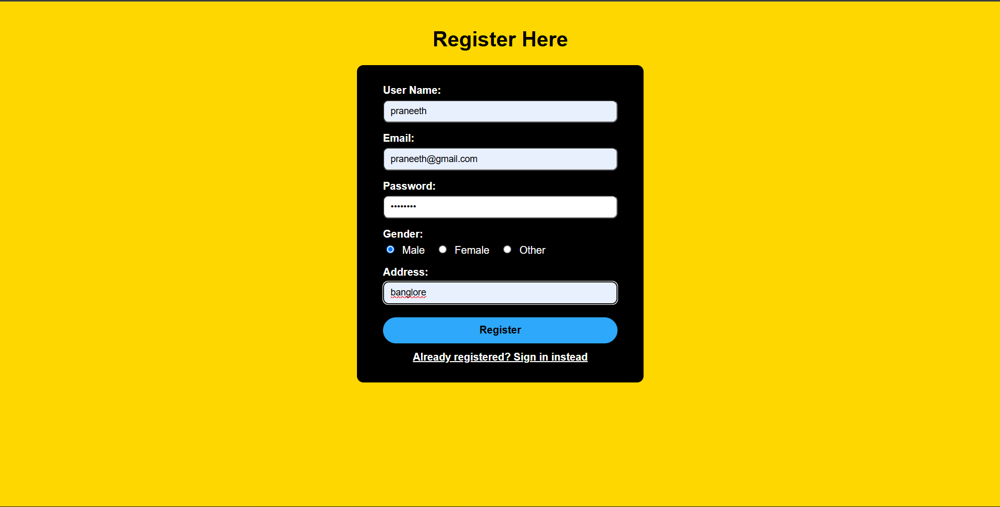
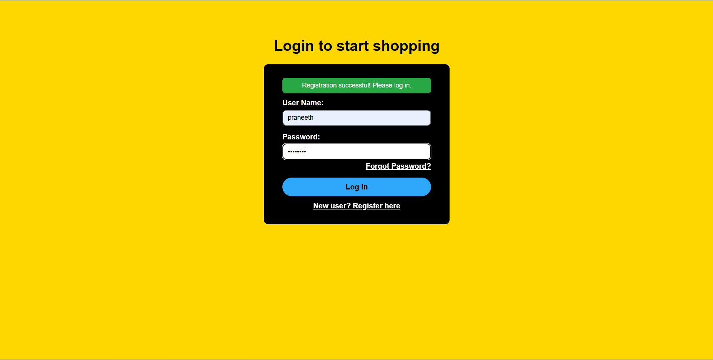
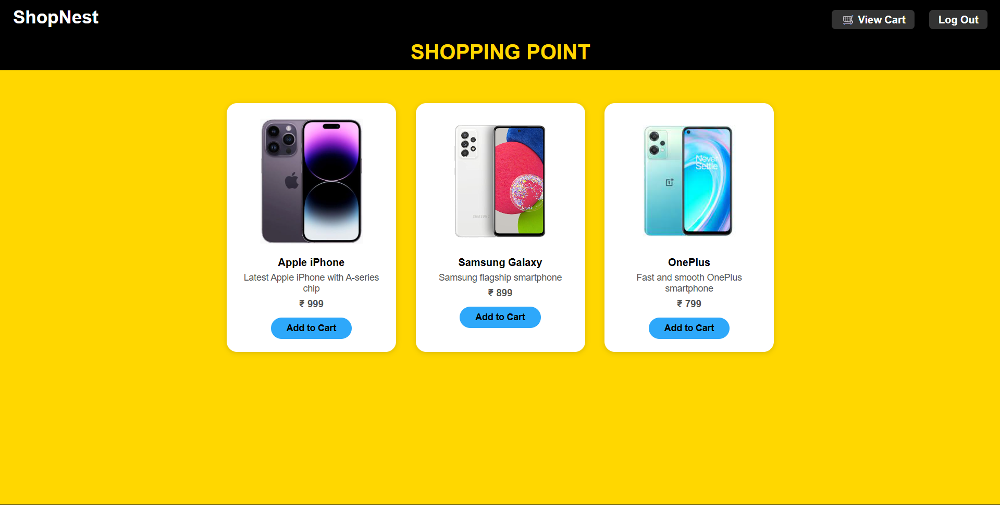
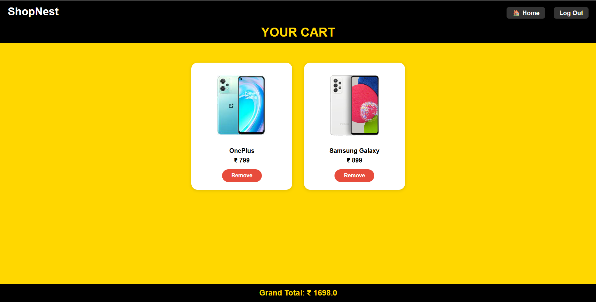

# ShopNest
A full-stack Java EE e-commerce platform featuring secure user authentication, dynamic product management, and session-based shopping cart functionality built using Servlets, JSP, and MySQL.

---

## Table of Contents

- [Overview](#overview)
- [Tech Stack](#tech-stack)
- [Screenshots](#screenshots)
- [Project Structure](#project-structure)
- [Database Schema](#database-schema)
- [Features](#features)
- [Servlet Endpoints](#servlet-endpoints)
- [Getting Started](#getting-started)
- [Configuration](#configuration)
- [Security](#security)

---

## Overview

ShopNest is a classic Dynamic Web Project built with raw Java Servlets and JSP views, using direct JDBC for all database operations. There is no Spring, no Hibernate, and no build tool — just clean Java EE backed by MySQL, packaged for Tomcat.

---

## Tech Stack

| Layer            | Technology                              |
|------------------|-----------------------------------------|
| Language         | Java 17                                 |
| Server           | Apache Tomcat 9.0                       |
| Web Spec         | Servlet API 4.0 (`javax.servlet`)       |
| Views            | JSP (JavaServer Pages)                  |
| Database         | MySQL 8.x (`localhost:3306/shopnest`)   |
| JDBC Driver      | `mysql-connector-j-9.7.0.jar`           |
| IDE / Build      | Eclipse (Dynamic Web Project)           |
| Password Hashing | SHA-256 via `java.security.MessageDigest` |

---

## Screenshots

### 1. Secure User Registration
New users can create accounts with secure credential storage and profile information management.



---

### 2. User Authentication
Secure login system with session-based authentication and password protection.



---

### 3. Dynamic Product Catalog
Products are dynamically fetched from MySQL and displayed through server-rendered JSP pages.



---

### 4. Session-Based Shopping Cart
Users can add, manage, and review products with cart data maintained through server-side sessions.



---

## Project Structure

```
com.shopNest/
├── src/main/java/
│   ├── com/shopNest/
│   │   ├── admin/
│   │   │   └── ProductServlet.java         # POST /addP — add product (admin only)
│   │   ├── customer/
│   │   │   ├── LoginServlet.java           # POST /login
│   │   │   ├── RegisterServlet.java        # POST /register
│   │   │   └── Validator.java              # Login credential checker
│   │   ├── dbHandler/
│   │   │   ├── DBConnection.java           # JDBC connection factory
│   │   │   ├── DataFetcher.java            # All SELECT queries
│   │   │   ├── DataInjector.java           # INSERT / UPDATE / DELETE
│   │   │   └── PasswordUtil.java           # SHA-256 hash and verify
│   │   └── product/
│   │       ├── Product.java                # Product model
│   │       ├── Cart.java                   # Session-scoped shopping cart
│   │       └── AddToCartServlet.java       # POST /add-to-cart
│   └── other/
│       ├── ForgotPasswordServlet.java      # POST /forgot
│       ├── LogOutServlet.java              # GET /log
│       ├── PassValidator.java              # Password reset logic
│       └── RemoveProductServlet.java       # POST /rem
│
├── src/main/webapp/
│   ├── WEB-INF/
│   │   ├── web.xml                         # Welcome file: register.jsp
│   │   └── lib/
│   │       └── mysql-connector-j-9.7.0.jar
│   ├── prodimg/                            # Product image assets
│   ├── register.jsp                        # Landing page — registration form
│   ├── login.jsp                           # Login form
│   ├── home.jsp                            # Product listing (authenticated users)
│   ├── cart.jsp                            # Shopping cart view
│   ├── admin.jsp                           # Admin panel (tabbed)
│   ├── ForgotPassword.jsp                  # Password reset form
│   └── style.css
│
└── build/classes/                          # Eclipse compiled output
```

---

## Database Schema

Run the following SQL to set up the `shopnest` database:

```sql
CREATE DATABASE shopnest;
USE shopnest;

CREATE TABLE customers (
    uname   VARCHAR(100) PRIMARY KEY,
    mail    VARCHAR(150),
    pass    VARCHAR(64),   -- SHA-256 hex hash
    gender  VARCHAR(10),
    address VARCHAR(255)
);

CREATE TABLE products (
    pid     INT PRIMARY KEY,
    pname   VARCHAR(150),
    pdesc   VARCHAR(500),
    pprice  INT,
    pimg    VARCHAR(100)   -- image filename, served from prodimg/
);
```

---

## Features

**Customer**
- Register a new account (name, email, password, gender, address)
- Log in / log out with session management
- Browse all products on the home page
- Add products to a personal session-scoped cart
- Remove items from the cart
- Reset forgotten password (verified by username + email)

**Admin**
- Role-based access enforced via HTTP session (`role = "admin"`)
- View all registered customers in a data table
- View all products, including images and prices
- Add new products to the store
- Remove products from the store

---

## Servlet Endpoints

| URL              | Method | Servlet                   | Description                                      |
|------------------|--------|---------------------------|--------------------------------------------------|
| `/register`      | POST   | `RegisterServlet`         | Creates a new customer account                   |
| `/login`         | POST   | `LoginServlet`            | Authenticates user; routes admin vs. customer    |
| `/log`           | GET    | `LogOutServlet`           | Invalidates session and redirects to login       |
| `/add-to-cart`   | POST   | `AddToCartServlet`        | Adds a product to the session cart               |
| `/rem`           | POST   | `RemoveProductServlet`    | Removes item from cart (user) or DB (admin)      |
| `/addP`          | POST   | `ProductServlet`          | Admin only — adds a new product to the database  |
| `/forgot`        | POST   | `ForgotPasswordServlet`   | Resets password after username/email verification|

---

## Getting Started

### Prerequisites

- Java 17+
- Apache Tomcat 9.0
- MySQL 8.x
- Eclipse IDE for Enterprise Java Developers (or any IDE supporting Dynamic Web Projects)

### Setup

1. **Clone or import the project** into Eclipse as an existing project.

2. **Create the database** by running the SQL from the [Database Schema](#database-schema) section.

3. **Add the admin account** manually:

   ```sql
   -- Password hash is SHA-256 of your chosen admin password
   INSERT INTO customers (uname, mail, pass, gender, address)
   VALUES ('admin', 'admin@shopnest.com', '<sha256_hash>', 'N/A', 'N/A');
   ```

   You can generate a SHA-256 hash online or use any Java snippet:
   ```java
   // Quick hash utility
   MessageDigest.getInstance("SHA-256").digest("yourpassword".getBytes())
   ```

4. **Update the DB credentials** in `DBConnection.java` if needed (see [Configuration](#configuration)).

5. **Deploy to Tomcat** — right-click the project in Eclipse → `Run As` → `Run on Server` → select your Tomcat 9.0 instance.

6. **Open the app** at `http://localhost:8080/com.shopNest/`

---

## Configuration

All database connection details are in one place:

```
src/main/java/com/shopNest/dbHandler/DBConnection.java
```

```java
private static final String URL     = "jdbc:mysql://localhost:3306/shopnest";
private static final String DB_USER = "root";
private static final String DB_PASS = "system";
```

Update `DB_USER` and `DB_PASS` to match your local MySQL credentials before running.

---

## Security

- **Passwords** are never stored in plain text. All passwords are hashed with SHA-256 before being written to the database.
- **SQL injection** is prevented throughout — every query uses `PreparedStatement` with parameterized inputs.
- **Role-based access** is enforced server-side on every protected servlet and JSP. Pages check the session `role` attribute and redirect to login if the check fails.
- **Session management** — logging out calls `session.invalidate()`, which clears all session data including the cart.
